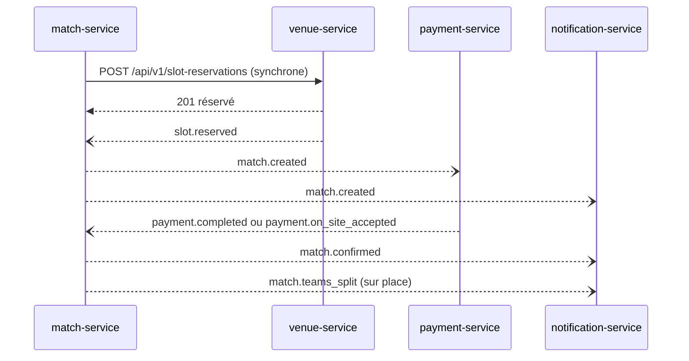

# Catalogue des événements Kafka — TeamSlot

| | |
|---|---|
| **Ticket** | SCRUM-24 |
| **Version** | 1.1 — Sprint 1 (ajout de `acceptsOnSitePayment` dans `match.created`) |
| **Source** | Conception TeamSlot, section 7.3 ; contrats `docs/api/*.yaml` |

Les services communiquent par événements (ADR-002). Ce catalogue est **la référence** : un producteur n'émet que des événements listés ici, avec ces noms et ces champs, et tout nouvel événement est ajouté dans ce fichier **dans la même pull request** que le code qui le produit.

---

## 1. Conventions

| Règle | Détail |
|---|---|
| **Nom du topic** | `domaine.événement`, en minuscules, au passé : `slot.reserved`, `match.created`. Un topic par type d'événement. |
| **Clé du message** | L'identifiant de l'agrégat concerné (voir la colonne « Clé »). Tous les événements d'un même match arrivent ainsi dans l'ordre. |
| **Format** | JSON, enveloppe commune ci-dessous. Dates en ISO 8601 UTC, identifiants en UUID. |
| **Montants** | En centimes, avec la devise à côté : `"totalAmount": 30000, "currency": "MAD"` pour 300 MAD. |
| **Publication fiable** | Le producteur écrit l'événement dans une table *outbox* dans la même transaction que son changement d'état ; un relais le publie ensuite. Aucun événement n'est perdu si le service s'arrête entre les deux. |
| **Idempotence** | Chaque consommateur enregistre les `eventId` déjà traités : un événement reçu deux fois n'a qu'un seul effet. |
| **Message invalide** | Mis de côté dans un topic `*.dlt` (*dead-letter topic*) sans bloquer les suivants. |
| **Données personnelles** | Le strict nécessaire : un invité sans compte n'apparaît que par son surnom ; aucun mot de passe ni jeton dans un événement. |

### Règle d'évolution

> **On ajoute des champs, on n'en supprime jamais.**
> Un consommateur ignore les champs qu'il ne connaît pas. Si un changement casse la compatibilité (renommer, supprimer, changer un type), on incrémente `version` et le producteur publie les deux versions le temps que tous les consommateurs migrent.

## 2. Enveloppe commune

Tous les événements ont la même enveloppe ; seul `data` change.

```json
{
  "eventId": "8c1f2a4e-6b1d-4f3a-9e2c-1d5b7a9c0e11",
  "type": "match.teams_split",
  "version": 1,
  "occurredAt": "2026-10-12T20:02:00Z",
  "producer": "match-service",
  "data": {
    "matchId": "3f0c9b2a-7e41-4d8a-b1c6-2a9e5f7d4c10",
    "strategy": "random",
    "sideA": ["user:12", "guest:Yassir"],
    "sideB": ["user:7", "user:31"]
  }
}
```

| Champ | Type | Rôle |
|---|---|---|
| `eventId` | UUID | Identifiant unique de l'événement, utilisé pour l'idempotence |
| `type` | texte | Nom du topic (`match.teams_split`) |
| `version` | entier | Version du schéma de `data` ; commence à 1 |
| `occurredAt` | date-heure UTC | Moment où le fait s'est produit |
| `producer` | texte | Service émetteur (`match-service`) |
| `data` | objet | Contenu propre à l'événement (tableaux ci-dessous) |

## 3. Événements par service

La colonne **S1** marque les événements nécessaires aux stories du Sprint 1 (SCRUM-57 à 62).

### identity-service

| Topic | Clé | Consommateurs | Champs de `data` | S1 |
|---|---|---|---|---|
| `user.registered` | userId | notification | userId, displayName, phone | ✓ |

### venue-service

| Topic | Clé | Consommateurs | Champs de `data` | S1 |
|---|---|---|---|---|
| `venue.created` | venueId | search, match | venueId, ownerId, name, latitude, longitude, pricePerHour, acceptsOnSitePayment | |
| `venue.updated` | venueId | search, match | venueId, champs modifiés | |
| `slot.reserved` | venueId | search, match | venueId, slotId, matchId, start, end, totalAmount, currency | ✓ |
| `slot.released` | venueId | search, match | venueId, slotId, matchId, reason | ✓ |

### team-service

| Topic | Clé | Consommateurs | Champs de `data` | S1 |
|---|---|---|---|---|
| `team.created` | teamId | search | teamId, name, city, captainId | |
| `team.invitation_sent` | teamId | notification | teamId, invitationId, userId, type (INVITATION / JOIN_REQUEST) | |
| `team.member_joined` | teamId | match, notification, search | teamId, userId, role | |
| `team.member_left` | teamId | match, notification, search | teamId, userId | |
| `team.captain_changed` | teamId | match, notification | teamId, previousCaptainId, newCaptainId | |

### match-service

| Topic | Clé | Consommateurs | Champs de `data` | S1 |
|---|---|---|---|---|
| `match.created` | matchId | payment, notification, search | matchId, kind, visibility, ownerId, payerId, venueId, slotId, startsAt, totalAmount, currency, acceptsOnSitePayment | ✓ |
| `match.participant_added` | matchId | notification, messaging | matchId, participantId, userId ou guestName | ✓ |
| `match.co_organizer_added` | matchId | notification | matchId, userId | |
| `match.spots_opened` | matchId | search, notification | matchId, venueId, startsAt, openSpots | |
| `match.join_requested` | matchId | notification | matchId, userId | |
| `match.join_accepted` | matchId | notification, messaging | matchId, userId | |
| `match.challenge_posted` | matchId | search, notification | matchId, teamId, opponentTeamId (défi direct), visibility, startsAt | |
| `match.challenge_accepted` | matchId | notification, messaging | matchId, teamId, opponentTeamId | |
| `match.confirmed` | matchId | notification, search | matchId | ✓ |
| `match.teams_split` | matchId | notification | matchId, strategy, sideA, sideB (`user:<id>` ou `guest:<surnom>`) | ✓ |
| `match.cancelled` | matchId | venue, payment, notification, search | matchId, reason, cancelledBy | |
| `match.no_show` | matchId | review, notification | matchId, absentUserIds | |
| `match.result_submitted` | matchId | notification | matchId, scoreA, scoreB, submittedBy | |
| `match.result_confirmed` | matchId | team, review, notification | matchId, scoreA, scoreB | |
| `match.result_disputed` | matchId | notification | matchId | |
| `match.mvp_elected` | matchId | team, review, notification | matchId, participantIds | |

### payment-service

| Topic | Clé | Consommateurs | Champs de `data` | S1 |
|---|---|---|---|---|
| `payment.completed` | matchId | match, notification | matchId, paymentId, payerId, mode (ONLINE), totalAmount, currency | ✓ |
| `payment.on_site_accepted` | matchId | match, notification | matchId, paymentId, payerId, totalAmount, currency | ✓ |
| `payment.collected_on_site` | matchId | match, review | matchId, paymentId, collectedBy, collectedAt | |
| `payment.failed` | matchId | match, notification | matchId, paymentId, reason | |
| `payment.refunded` | matchId | notification | matchId, paymentId, amount, currency | |

### review-service

| Topic | Clé | Consommateurs | Champs de `data` | S1 |
|---|---|---|---|---|
| `player.stats_updated` | userId | notification | userId, matchesPlayed, mvpCount, reliabilityScore | |

## 4. Exemple de chaîne : le parcours « groupe d'amis »



## 5. Points à confirmer en relecture

1. **Consommateurs par topic.** La conception donne les consommateurs par service producteur ; leur répartition topic par topic ci-dessus est déduite des parcours. Chaque responsable de service vérifie sa ligne.
2. **Libération du créneau à l'annulation.** Tranché (SCRUM-25) : venue-service consomme `match.cancelled` et libère le créneau, sans appel synchrone de match vers venue ; il publie ensuite `slot.released`. `match.cancelled` n'est pas dans les topics du Sprint 1 : son topic et son `.dlt` doivent être ajoutés à `create-topics.sh` avant la première publication.
3. **Montants.** L'exemple de la conception écrit `300` ; ce catalogue suit la convention des contrats d'API (centimes : `30000`).

## 6. Historique des changements

| Version | Changement | Raison |
|---|---|---|
| 1.1 | Champ `acceptsOnSitePayment` (booléen) ajouté dans `match.created` | payment-service doit savoir si le terrain accepte le paiement sur place (SCRUM-62). match-service le reçoit de venue dans la réponse de réservation. Ajout de champ : compatible avec les consommateurs existants. |
