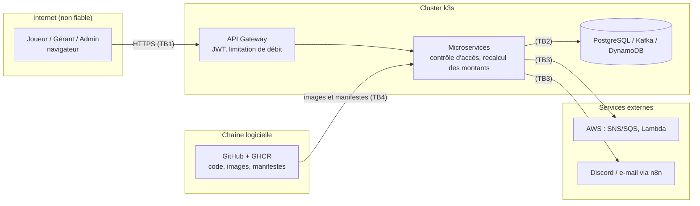

# Modèle de menaces — TeamSlot

| | |
|---|---|
| **Ticket** | SCRUM-13 |
| **Version** | 1.0 — Sprint 0 |
| **Méthode** | STRIDE sur le schéma des flux et des frontières de confiance |
| **Source** | Conception TeamSlot v1.1, section 12 (et sections 6.2 et 10) |
| **Relecture** | Aya, puis Sara (référente de la CI de sécurité) |

Ce document répond à trois questions : **que protège-t-on ?** **Contre qui et comment ?** **Quel contrôle, et quel test, l'empêche ?**
Il est vivant : toute nouvelle fonctionnalité qui franchit une frontière de confiance ajoute ou met à jour une ligne.

---

## 1. Ce que l'on protège

| Actif | Pourquoi c'est sensible | Où il vit |
|---|---|---|
| Comptes et jetons (JWT, refresh) | Usurper un joueur ou un gérant | identity-service |
| Réservations et matchs | Bloquer ou voler un créneau ; lire le match d'un autre | venue-service, match-service |
| Paiements et encaissements | Fraude, double débit, faux encaissement sur place | payment-service |
| Données personnelles | Téléphone des joueurs ; un invité n'est qu'un surnom (minimisation) | identity-service, match-service |
| Secrets (clés, jetons CI, identifiants AWS) | Accès à la chaîne de livraison et au cloud | GitHub, cluster (secrets scellés) |
| Chaîne logicielle | Code, dépendances et images déployés dans le cluster | GitHub, GHCR, Argo CD |

## 2. Qui peut attaquer

| Acteur | Niveau de confiance |
|---|---|
| Internet (toute personne non authentifiée) | Aucune |
| Joueur / organisateur / capitaine authentifié | Limitée : ne voit et ne modifie que ce qui le concerne |
| Gérant de terrain | Limitée : agit seulement sur **son** terrain |
| Administrateur | Élevée, mais tracée |
| Invité sans compte | Aucun accès : n'interagit pas avec le système |
| Dépendance ou image externe | Non fiable tant qu'elle n'est pas analysée |

## 3. Schéma des flux et frontières de confiance

| Frontière | Ce qu'elle sépare | Hypothèse de sécurité |
|---|---|---|
| **TB1** | Internet et le cluster | Tout ce qui vient d'un navigateur est non fiable |
| **TB2** | Les services et les données | Chaque service n'accède qu'à **sa propre base** ; aucune base partagée |
| **TB3** | Le cluster et les services externes (AWS, Discord, e-mail) | Identifiants limités aux services utilisés, stockés en secret scellé |
| **TB4** | La chaîne logicielle et le cluster | Seuls le code relu et les images analysées et signées arrivent en production |

## 4. Menaces et contre-mesures (STRIDE)

| STRIDE | Menace dans TeamSlot | Contre-mesure | Test prévu |
|---|---|---|---|
| **S**poofing (usurpation) | Vol ou falsification d'un JWT ; se faire passer pour le gérant afin de confirmer un paiement | JWT signé, expiration courte, refresh révocable, OTP (recommandé) ; rôle de gérant vérifié sur le terrain concerné | S3, S14 |
| **T**ampering (altération) | Modifier le prix ou l'équipement envoyé ; publier un faux événement ; image modifiée | Montants recalculés côté serveur ; Kafka interne au cluster (ACL en backlog) ; images signées (Cosign), `main` protégée | S5 |
| **R**epudiation (déni) | Un capitaine nie avoir retiré un membre ; un gérant nie un encaissement | Journal d'audit des actions sensibles ; logs horodatés avec identifiant de corrélation | Revue du journal |
| **I**nformation disclosure (fuite) | Lire le match ou l'équipe d'un autre (IDOR) ; données d'invités ; secrets ; endpoints Actuator exposés | Contrôle de propriété à chaque requête ; invité = simple surnom ; Gitleaks, secrets scellés ; Actuator interne | S1, S8, S10 |
| **D**enial of service | Rafale de réservations, d'invitations ou de votes ; force brute sur le login | Limitation de débit à la passerelle (429), verrouillage temporaire du compte, autoscaling des services sollicités | S4, test k6 |
| **E**levation of privilege | Un membre se déclare capitaine ; un joueur accède à l'administration ; conteneur root | Rôles vérifiés côté serveur, DTO dédiés (pas d'affectation de masse), pods non-root et Pod Security | S2, S12, Checkov |
| Chaîne logicielle (TB4) | Dépendance vulnérable ou compromise ; image de base vulnérable | Trivy, Dependency-Check, Dependabot, SBOM (Syft), signature des images, quality gates bloquants | Pipeline |

### 4.1 Menaces complémentaires propres à TeamSlot (à valider en relecture)

Déduites des règles métier (conception 6.2) et de la matrice des droits (conception 10.1).

| Menace | STRIDE | Contre-mesure prévue par la conception | Test |
|---|---|---|---|
| Un gérant confirme l'encaissement d'un terrain qui n'est pas le sien | S, E | « Seul le gérant du terrain confirme » ; rôle vérifié sur le terrain concerné | S2 (à étendre) |
| Un joueur rejoint un match complet en appelant l'endpoint directement | T | Règles d'état vérifiées côté serveur (409) | S9 |
| Deux réservations simultanées du même créneau | T | Contrainte d'exclusion en base : une seule réservation gagne | Test d'intégration |
| Rejeu d'un paiement ou d'un événement Kafka | T | Clés d'idempotence, unicité en base, événements traités enregistrés | S6 |
| Un participant vote deux fois, pour soi, ou sans avoir joué | T | `UNIQUE (match_id, voter_id)`, `CHECK (voter_id <> candidate_id)`, vote réservé aux participants avec compte | Test automatisé |
| Un joueur modifie son propre rôle via `PATCH /users/me` | E | DTO dédiés : les champs sensibles ne sont jamais liés à la requête | Test automatisé |
| Un invité sans compte vote ou se connecte | S | Un invité n'est qu'un surnom : aucune authentification, aucun vote | Test automatisé |

## 5. Plan de tests de sécurité (extrait utilisé par ce modèle)

| ID | Scénario | Résultat attendu |
|---|---|---|
| S1 | Un joueur lit ou modifie le match d'un autre en changeant l'identifiant (IDOR) | 403 ou 404, aucune donnée exposée |
| S2 | Un joueur appelle un endpoint d'administration | 403 |
| S3 | JWT expiré, signature modifiée ou algorithme « none » | 401 |
| S4 | Force brute sur le login (centaines de tentatives) | Verrouillage ou 429 ; alerte visible dans Grafana |
| S5 | Le client envoie un prix ou un montant modifiés | Le serveur ignore la valeur et recalcule |
| S6 | Rejeu de la même requête de paiement ou du même événement | Un seul débit enregistré |
| S7 | Upload d'un faux fichier (logo d'équipe) ou d'un fichier trop gros | Refus avec une erreur claire |
| S8 | Injection SQL dans les paramètres de recherche de terrains | Aucune erreur SQL, aucun résultat détourné |
| S9 | Rejoindre un match déjà complet en appelant l'endpoint directement | 409, place refusée |
| S10 | Accès public à `/actuator/env` ou `/actuator/heapdump` | Non exposé (404 ou 401) |
| S11 | Position GPS falsifiée pour un check-in (recommandé) | Check-in refusé si l'écart est trop grand |

> **À compléter avant fusion :** les identifiants **S12** et **S14**, cités dans le tableau du § 4 (élévation de privilège et usurpation), renvoient au plan de tests de sécurité du dossier de projet, dont la version relue ici s'arrête à S11. Reporter leur intitulé exact ici avant de fusionner.

## 6. Risques acceptés et points en backlog

| Point | Décision | Échéance |
|---|---|---|
| ACL et TLS Kafka (authentifier les producteurs d'événements) | Kafka reste interne au cluster pour l'instant ; ACL en backlog | Après le Sprint 1 |
| OTP à l'inscription | Recommandé, non obligatoire au démarrage | À trancher en Sprint Planning |
| Paiement en ligne | Simulé : aucune donnée de carte n'est traitée ni stockée | Jusqu'à l'ajout d'un vrai fournisseur (ADR à écrire) |
| Un seul broker Kafka et un seul cluster local | Acceptable pour un projet pédagogique ; disponibilité limitée | — |

## 7. Comment ce modèle reste vivant

1. **Nouvelle fonctionnalité** qui franchit une frontière (nouvel appel externe, nouveau rôle, nouvel endpoint sensible) : on ajoute la menace et son test dans ce fichier, dans la même pull request.
2. **Chaque contre-mesure** devient un test automatisé dans la CI dès qu'elle est implémentée (Gitleaks, SonarCloud, Trivy, tests d'autorisation, OWASP ZAP).
3. **Chaque règle de la matrice des droits** (conception 10.1) est un test.
4. **Revue** à la fin de chaque sprint : une menace nouvelle, une menace traitée, une menace acceptée.
